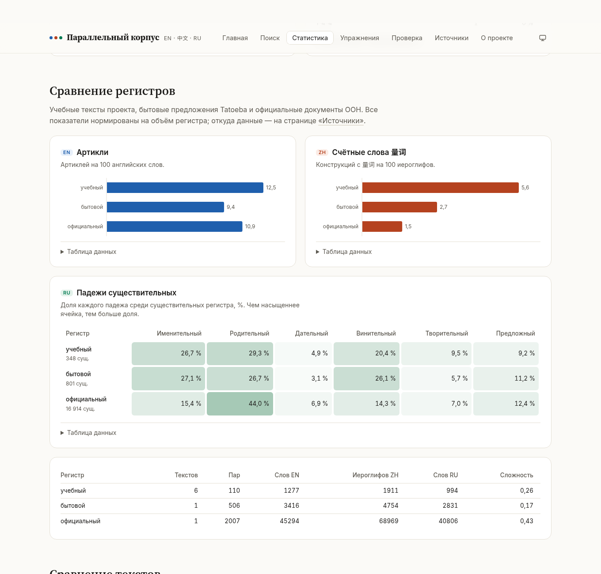
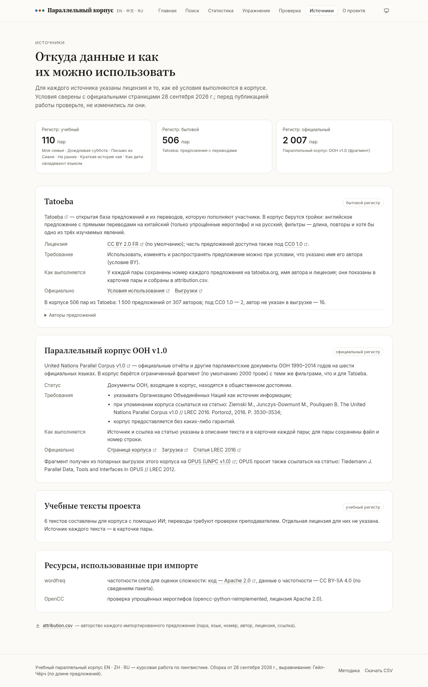
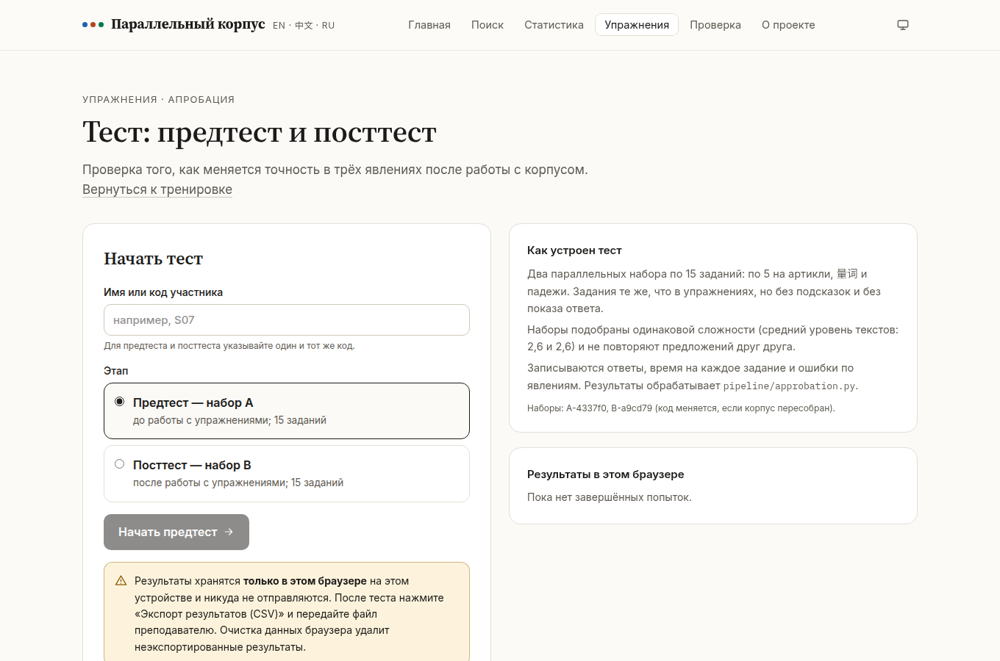
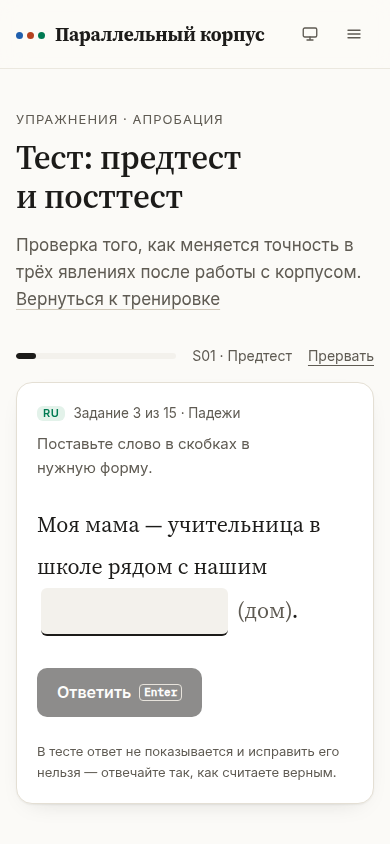

# Параллельный корпус EN · ZH · RU

Учебный параллельный корпус английского, китайского и русского языков с веб-интерфейсом
для поиска, статистики и упражнений. В корпусе размечены три явления, которые по-разному
устроены в этих языках:

| Язык | Явление | Как размечено |
|---|---|---|
| **EN** | артикли *a / an / the* и существительное, к которому они относятся | spaCy |
| **ZH** | счётные слова 量词 в конструкции «числительное / 这 / 那 / 几 / 每 + 量词 + существительное» | jieba + редактируемый список 量词 |
| **RU** | падеж, число и лемма существительных | pymorphy3 + контекстные правила |

Проект сделан для курсовой работы «Параллельный учебный корпус (английский/китайский/русский)
как инструмент отработки лексико-грамматических соответствий: проектирование и апробация на
примере ИИ-ассистированной сборки».

Кроме учебных текстов, в корпус импортированы реальные данные двух регистров: бытовые
предложения из [Tatoeba](https://tatoeba.org) и официальные документы из
[Параллельного корпуса ООН](https://www.un.org/dgacm/en/content/uncorpus) (см. «Импорт
реальных данных» и страницу «Источники» на сайте).

**Сайт:** <https://lolkotick.github.io/corpus/> (публикуется из ветки `main`, см. «Деплой»).


## Возможности

- **Поиск** на любом из трёх языков с подсветкой во всех колонках. Русские существительные
  находятся по лемме («чай» → «чая», «чаем»). Вероятные переводы найденного слова подсвечиваются
  в других колонках — это словарь эквивалентов, построенный по корпусу. Фильтры: явление,
  конкретный падеж или 量词, текст, уровень, статус проверки, `alignment_score`.
- **Конкорданс (KWIC)**: найденное слово в центре, сортировка по левому и правому контексту и по
  ключевому слову.
- **Карточка пары**: три предложения с цветной разметкой, данные выравнивания, комментарий LLM,
  таблицы разметки и эквивалентов.
- **Статистика** (Recharts): падежи, частотность 量词, артикли, распределение `alignment_score`,
  сравнение текстов и регистров (учебный / бытовой / официальный). Под каждым графиком есть
  таблица данных.
- **Источники**: откуда взяты данные, лицензии, требуемое указание авторства, авторы
  предложений Tatoeba; в карточке пары — номер, автор и лицензия каждого предложения.
- **Упражнения**, собранные из предложений корпуса:
  - EN — вставить артикль;
  - ZH — выбрать 量词 из четырёх вариантов;
  - RU — поставить слово в нужный падеж.
  
  Проверка мгновенная, к каждому ответу — объяснение, в конце — итоги. Прогресс сохраняется в
  браузере. Для уроков есть версия для печати с отдельной страницей ключей.
- **Тест для апробации** (Упражнения → «Режим «Тест»»): предтест и посттест на двух
  фиксированных наборах одинаковой сложности (по 15 заданий), код участника, запись ответов,
  времени и ошибок, экспорт в CSV. Анализ — `python -m pipeline approbation`.
- **Проверка (золотой стандарт)**: эксперт размечает выборку пар — выравнивание EN–ZH и EN–RU
  и каждую пометку (верно / ошибка / исправление, пропуски). Горячие клавиши, счётчик
  прогресса, экспорт и импорт `gold.json`. По этому файлу `python -m pipeline evaluate`
  считает точность, полноту и F1 (см. раздел «Оценка качества»).
- Светлая и тёмная тема, адаптивная вёрстка, навигация с клавиатуры. Проверка axe-core —
  0 нарушений WCAG 2.1 A/AA.

## Скриншоты

| Поиск: совпадения и эквиваленты | Конкорданс (KWIC) |
|---|---|
|  |  |
| **Карточка пары** | **Статистика** |
|  |  |
| **Упражнение на 量词** | **Версия для печати** |
|  |  |
| **Сравнение регистров** | **Источники и лицензии** |
|  |  |
| **Тёмная тема** | **Телефон** |
|  |  |

Макеты, из которых выбрано оформление, — в [`design/mockups.html`](design/mockups.html)
(открыть в браузере).

## Структура репозитория

```
pipeline/                     Python 3.11: тексты → корпус
  sources.py, segment.py      чтение текстов и сегментация
  importers/                  импорт реальных данных: tatoeba.py, un_corpus.py, common.py
  difficulty.py               оценка сложности пары (длина + частотность лексики)
  align/                      выравнивание: LaBSE (алгоритм Bertalign), bertalign, Гейл–Чёрч
  annotate/                   разметка: en.py (артикли), zh.py (量词), ru.py (падежи)
  lexicon.py                  переводные эквиваленты (коэффициент Дайса)
  manual.py, llm.py           ручные правки из CSV, LLM-проверка
  export.py, report.py        corpus.json / corpus.csv / stats.json, журнал сборки
  gold.py, evaluate.py        золотой стандарт и оценка качества (P / R / F1)
  compare_aligners.py         сравнение методов выравнивания (align/baseline.py, llm_align.py)
  error_analysis.py           типы ошибок разметки по эталону
  approbation.py              результаты предтеста и посттеста (режим «Тест»)
  metrics.py, charts.py, tables.py  метрики, графики PNG и таблицы CSV для отчётов
  corpus_report.py            описание корпуса для курсовой
  reports.py, docx_export.py  все отчёты одной командой, копии в Word
  resources/zh_classifiers.tsv  редактируемый список счётных слов
  config.yaml                 все настройки
  tests/                      pytest (tests/fixtures — синтетические данные для тестов)
data/raw/<text_id>/           входные тексты: en.txt, zh.txt, ru.txt, meta.json
                              (у импортированных — ещё units.jsonl: происхождение каждой тройки)
data/sources/                 скачанные выгрузки источников (кэш, в git не хранится)
data/manual/overrides.json    ручные правки (создаётся импортом CSV)
data/llm_cache/               сохранённые ответы LLM
data/gold/gold.json           эталон — экспорт из режима «Проверка» (создаёт эксперт)
data/approbation/             CSV участников из режима «Тест»
reports/                      отчёты для курсовой (Markdown, CSV, PNG, docx/) — см. reports/README.md
docs/research_log.md          журнал исследования: хронология, проблемы и решения
scripts/build_reports.py      пересборка всех отчётов (также make reports)
logs/build_report.md          журнал последней сборки
logs/import_*.md              журналы импорта: сколько строк прошло каждый фильтр
web/                          сайт: Vite + React + TypeScript + Tailwind
  public/data/                данные для сайта (результат pipeline)
  src/lib/                    поиск, KWIC, упражнения, прогресс, эталон (с тестами Vitest)
  src/pages/                  главная, поиск, пара, статистика, упражнения, печать, проверка,
                              источники, о проекте
  scripts/screenshots.mjs     скриншоты и проверка доступности (axe-core)
design/mockups.html           макеты главной и поиска
docs/screenshots/             скриншоты для README
scripts/setup.ps1             установка на Windows одной командой
.github/workflows/            CI (pytest, ruff, ESLint, Prettier, TypeScript, Vitest), деплой,
                              import.yml — импорт реальных данных в GitHub Actions
```

## Установка на Windows

Понадобятся:
- [Python 3.11](https://www.python.org/downloads/release/python-3119/) — при установке отметьте
  **«Add python.exe to PATH»**;
- [Node.js 22 LTS](https://nodejs.org/);
- [Git](https://git-scm.com/download/win).

```powershell
git clone https://github.com/lolkotick/corpus.git
cd corpus
.\scripts\setup.ps1          # или .\scripts\setup.ps1 -Neural — вместе с LaBSE (~2 ГБ)
```

Если PowerShell пишет, что выполнение сценариев отключено, выполните один раз:
`Set-ExecutionPolicy -Scope CurrentUser RemoteSigned`.

<details>
<summary>То же вручную (и для Linux/macOS)</summary>

```powershell
py -3.11 -m venv .venv
.venv\Scripts\Activate.ps1                 # Linux/macOS: source .venv/bin/activate
python -m pip install -r pipeline\requirements-dev.txt
python -m spacy download en_core_web_sm
cd web
npm ci
```
</details>

## Запуск pipeline

Все команды выполняются из корня репозитория с активированным окружением
(`.venv\Scripts\Activate.ps1`):

```powershell
python -m pipeline check            # проверить входные тексты (абзацы, число предложений)
python -m pipeline build            # собрать корпус
python -m pipeline build --no-llm   # собрать без запросов к LLM
pytest                              # тесты pipeline
```

Результат сборки:
- `web/public/data/corpus.json` — корпус для сайта;
- `web/public/data/corpus.csv` — таблица для проверки в Excel;
- `web/public/data/stats.json` — статистика;
- `logs/build_report.md` — журнал сборки: время каждого этапа, число пар по текстам, типы
  соответствий, результаты разметки, предупреждения, число правок, предложенных LLM.

Этапы: чтение → сегментация → выравнивание → ручные правки → разметка EN / ZH / RU →
переводные эквиваленты → LLM-проверка → экспорт.

### Выравнивание: LaBSE или Гейл–Чёрч

В `pipeline/config.yaml` параметр `alignment.method: auto` пробует методы по очереди:
1. пакет `bertalign` (только Python ≥ 3.12);
2. LaBSE через `sentence-transformers` — тот же алгоритм Bertalign, реализованный в
   `align/embedding.py`;
3. метод Гейла–Чёрча по длине предложений.

Для нейросетевого варианта: `pip install -r pipeline\requirements-neural.txt` — при первом
запуске скачается модель LaBSE (~1,8 ГБ). Какой метод сработал и почему, записывается в журнал
сборки.

Английский — опорный язык. Пары EN–ZH и EN–RU выравниваются отдельно (1–1, 1–2, 2–1) и
объединяются в тройки. `alignment_type` — число предложений EN-ZH-RU (например, `1-2-1`),
`alignment_score` — оценка 0…1 по более слабой паре. Если число абзацев во всех трёх файлах
совпадает, выравнивание идёт внутри абзацев.

### LLM-проверка (необязательно)

Скопируйте `.env.example` в `.env` и впишите `ANTHROPIC_API_KEY=...`. Модуль отправляет модели
пары с низким `alignment_score` и спорную разметку и записывает в `llm_note` вердикт, предложение
исправления и комментарий.
- **Данные модель не меняет.**
- Модель, глубина рассуждений и лимит пар задаются в секции `llm` файла `config.yaml`.
- Ответы сохраняются в `data/llm_cache/`, поэтому повторная сборка не тратит запросы, а сборка
  без ключа применяет уже полученные ответы.
- Без ключа модуль просто пропускается.

## Добавление текста

1. Создайте папку `data/raw/<id_текста>/` — латиницей, без пробелов, например `data/raw/winter_story/`.
2. Положите туда `en.txt`, `zh.txt`, `ru.txt` в кодировке UTF-8. Абзацы разделяйте пустой
   строкой: если число абзацев во всех файлах совпадает, выравнивание будет точнее.
3. Создайте `meta.json`:

   ```json
   {
     "title": "A Rainy Saturday",
     "title_ru": "Дождливая суббота",
     "title_zh": "一个下雨的星期六",
     "source": "Откуда взят текст",
     "topic": "Тематика",
     "level": "A2"
   }
   ```

   Уровень — от A1 до C2. Обязательны `title`, `source`, `topic` и `level`.
4. Выполните `python -m pipeline check`, затем `python -m pipeline build`.

Счётные слова для китайской разметки перечислены в `pipeline/resources/zh_classifiers.tsv`.
Файл можно редактировать в Excel или блокноте: колонки через табуляцию — классификатор,
пиньинь, тип, толкование, типичные существительные.

## Импорт реальных данных

Два источника, по одному на регистр. Каждый импортируется как отдельный «текст» корпуса
(`data/raw/tatoeba/`, `data/raw/un_corpus/`); каждая тройка предложений — отдельный абзац,
поэтому выравнивается независимо от соседних.

```powershell
python -m pipeline import tatoeba            # 500 троек (по умолчанию)
python -m pipeline import un                 # 2000 троек (по умолчанию)
python -m pipeline build --no-llm            # пересобрать корпус
python -m pipeline reports --no-llm          # обновить отчёты
```

Параметры: `--limit N` — сколько троек взять (0 — все прошедшие фильтры), `--seed N` — seed
случайной выборки (по умолчанию 2026, выборка воспроизводима), `--from ПУТЬ` — взять
скачанные вручную файлы, `--max-lines N` (только `un`) — сколько первых строк просматривать,
`--any-sentence` — не требовать целевых явлений. Значения по умолчанию и адреса файлов — в
`pipeline/config.yaml`, раздел `importers`. Журнал каждого импорта (сколько строк отброшено
каждым фильтром) — `logs/import_tatoeba.md`, `logs/import_un.md`.

**Фильтры** (общие для обоих источников):

1. длина: EN и RU — от 3 до 25 слов, ZH — от 4 до 40 иероглифов (для ООН — до 40 слов и
   70 иероглифов);
2. дубликаты: тройка отбрасывается, если хотя бы одно из трёх предложений уже встречалось
   (без учёта регистра букв, пунктуации и ё/е);
3. хотя бы одно из трёх явлений: артикль *a / an / the* в EN, конструкция с 量词 в ZH
   (тот же шаблон, что в разметке) или существительное в косвенном падеже в RU (pymorphy3);
4. из прошедших фильтры — случайная выборка `limit` троек с фиксированным `seed`.

### Tatoeba (бытовой регистр)

Файлы с <https://tatoeba.org/downloads> скачиваются автоматически в `data/sources/tatoeba/`:
`eng/cmn/rus_sentences_detailed.tsv.bz2` (номер, язык, текст, автор, даты), `links.tar.bz2`
(связи «предложение — перевод») и `sentences_CC0.tar.bz2` (какие предложения под CC0).
Берётся английское предложение, у которого есть прямые переводы на китайский и русский.
Китайский перевод — только в упрощённых иероглифах: текст не должен меняться при переводе
OpenCC «традиционные → упрощённые». Если переводов несколько, берётся перевод с наименьшим
номером. Для каждого предложения сохраняются номер, автор и лицензия (`units.jsonl` →
`pair.origin`).

Если скачать не получается, скачайте эти файлы вручную со страницы загрузок и укажите папку:
`python -m pipeline import tatoeba --from D:\downloads\tatoeba` (архивы можно не
распаковывать).

### Корпус ООН (официальный регистр)

[United Nations Parallel Corpus v1.0](https://www.un.org/dgacm/en/content/uncorpus)
(Ziemski и др., 2016). Импортёр понимает два формата:

- **построчно выровненные файлы** всех трёх языков — `*.en`, `*.zh`, `*.ru` с одинаковым
  числом строк (полностью выровненный подкорпус UNv1.0.6way или наборы dev/test с
  официальной страницы загрузки) или `en.txt` / `zh.txt` / `ru.txt`;
- **попарные выгрузки OPUS** того же корпуса
  ([UNPC v1.0](https://opus.nlpl.eu/UNPC/corpus/version/UNPC)): `en-zh.txt.zip` и
  `en-ru.txt.zip`. Архивы читаются без распаковки. Тройка собирается по совпадающему
  английскому предложению; английские строки, которые повторяются в файле (типовые
  заголовки и формулы), пропускаются — их переводы могут относиться к разным документам.

По умолчанию (если не задан `importers.un_corpus.url`) скачиваются архивы OPUS. Это большие
файлы, поэтому просматриваются только первые `max_lines` строк (3 млн). Берутся только
законченные предложения: с заглавной буквы (в ZH — с иероглифа), со знаком конца
предложения, не набранные прописными целиком. Заголовки, пункты таблиц и обрывки
пропускаются (`sentences_only: false` в `config.yaml` отключает эту проверку).

**Если скачать невозможно** (нет интернета, сеть блокирует адреса):

1. Откройте <https://www.un.org/dgacm/en/content/uncorpus/download> и скачайте полностью
   выровненный подкорпус или наборы dev/test с английским, китайским и русским. Либо на
   <https://opus.nlpl.eu/UNPC/corpus/version/UNPC> скачайте Moses-архивы для пар en–zh и
   en–ru.
2. Положите файлы в `data/sources/un_corpus/`: три файла `*.en` / `*.zh` / `*.ru` (например,
   `UNv1.0.testset.en`, `.zh`, `.ru`) либо два архива `en-zh.txt.zip` и `en-ru.txt.zip`.
   Архив `.tar.gz` с файлами можно не распаковывать: `--from путь\к\архиву.tar.gz`.
3. Выполните `python -m pipeline import un`.

Если файлов нет и скачать их не удалось, команда выведет ту же инструкцию.

### Импорт в GitHub Actions

Workflow `.github/workflows/import.yml` делает всё сам на серверах GitHub: импорт → сборка
(`build --no-llm`) → отчёты → коммит в ту же ветку (`data/raw`, `web/public/data`, `logs`,
`reports`). Запуск: вкладка **Actions** → «Импорт реальных данных» → **Run workflow**. Там же
можно изменить `limit` и `max_lines`. Кнопка Run workflow появляется после того, как файл
workflow попал в ветку `main`. Если источник недоступен, шаг помечается предупреждением,
остальные шаги выполняются.

### Оценка сложности

У каждой пары есть `difficulty` — число от 0 до 1 — и уровень A1–C2 (`pipeline/difficulty.py`).
Для каждого языка:

- **длина** = min(число слов / L, 1), где L — «длинное предложение»: 30 слов EN, 30 слов ZH
  (по сегментации wordfreq), 25 слов RU;
- **редкость** = доля слов с частотностью ниже Zipf 4,0, то есть реже 10 употреблений на
  миллион слов (частотные словари пакета [wordfreq](https://github.com/rspeer/wordfreq));
- оценка языка = 0,5 · длина + 0,5 · редкость.

Оценка пары — среднее по трём языкам. Уровень получается порогами 0,19 / 0,22 / 0,28 /
0,345 / 0,45 (границы A1|A2|B1|B2|C1|C2). Пороги откалиброваны на учебных текстах корпуса:
это середины между медианами оценок пар с уровнем, который задал автор текста (A1 0,183,
A2 0,204, B1 0,240, B2 0,316, C1 0,374; 110 пар). Ранговая корреляция Спирмена оценки с
авторским уровнем — 0,575. Пороги можно изменить в `config.yaml` (`difficulty.thresholds`).

У учебных текстов уровень пары — уровень текста из `meta.json`. У импортированных — уровень
по оценке, а уровень всего «текста» — медиана уровней его троек. Это эвристика для
сортировки и фильтров, а не сертифицированный уровень CEFR. Калибровочная таблица и
распределение уровней по регистрам — в `reports/corpus.md`, раздел «Оценка сложности».

### Лицензии и указание авторства

| Источник | Лицензия | Что нужно делать |
|---|---|---|
| Tatoeba | [CC BY 2.0 FR](https://creativecommons.org/licenses/by/2.0/fr/); часть предложений — также [CC0 1.0](https://creativecommons.org/publicdomain/zero/1.0/) ([условия](https://tatoeba.org/terms_of_use)) | указывать имя автора предложения |
| Корпус ООН | документы ООН в общественном достоянии ([страница корпуса](https://www.un.org/dgacm/en/content/uncorpus)) | указывать ООН как источник; при упоминании корпуса ссылаться на Ziemski, Junczys-Dowmunt, Pouliquen (2016), LREC 2016; корпус предоставляется без гарантий |
| OPUS (если данные ООН получены через него) | — | OPUS просит ссылаться на Tiedemann J. Parallel Data, Tools and Interfaces in OPUS // LREC 2012 |

Условия сверены с официальными страницами 28.09.2026. Авторство каждого импортированного
предложения — в карточке пары на сайте и в `web/public/data/attribution.csv`.

## Ручная проверка через CSV

1. Откройте `web/public/data/corpus.csv` в Excel: **Данные → Из текста/CSV**, кодировка UTF-8.
2. Исправьте текст в колонках `en` / `zh` / `ru`, поставьте статус и при необходимости добавьте
   комментарий в колонку `comment`. Статусы:
   - `checked` («проверено») — пара проверена, ошибок нет;
   - `corrected` («исправлено») — текст или выравнивание исправлены (ставится автоматически,
     если текст изменён);
   - `delete` («удалить») — убрать пару из корпуса.

   Колонки `annotations` и `llm_note` — справочные, их не нужно править.
3. Сохраните файл как **«CSV UTF-8 (разделитель — запятая)»** — иначе иероглифы потеряются.
   Разделитель `;` тоже подходит: он определяется автоматически.
4. Импортируйте правки:

   ```powershell
   python -m pipeline import-csv путь\к\corpus.csv            # сохранить правки и пересобрать
   python -m pipeline import-csv путь\к\corpus.csv --dry-run  # только показать изменения
   ```

Правки сохраняются в `data/manual/overrides.json` и применяются при каждой сборке.
Исправленный текст размечается заново. Если после изменения входных текстов автоматический
сегмент с тем же id стал другим, правка не применяется, а в журнале сборки появляется
предупреждение.

## Сайт локально

```powershell
cd web
npm run dev        # режим разработки: http://localhost:5173
npm run build      # сборка в web/dist
npm run preview    # просмотр собранного сайта: http://localhost:4173
```

Проверки качества — те же, что в CI:

```powershell
npm run lint           # ESLint (строгие правила typescript-eslint, jsx-a11y, запрет any)
npm run format:check   # Prettier
npm run typecheck      # TypeScript
npm test               # Vitest: поиск, KWIC, упражнения
```

Скриншоты и проверка доступности (нужен запущенный `npm run preview` и
`npx playwright install chromium`): `npm run screenshots -- --axe`.

## Деплой на GitHub Pages

Сайт публикуется workflow `.github/workflows/deploy.yml` при каждом пуше в `main`.

1. Один раз включите Pages: **Settings → Pages → Build and deployment → Source: GitHub Actions**.
2. Обновите данные (`python -m pipeline build`), закоммитьте `web/public/data/` и отправьте в
   `main`. Workflow соберёт сайт и опубликует его по адресу
   `https://<пользователь>.github.io/<репозиторий>/` — здесь <https://lolkotick.github.io/corpus/>.

Сайт использует `HashRouter` и относительные пути (`base: './'`), поэтому работает в любой
подпапке и не требует серверных перенаправлений. Workflow CI (`ci.yml`) на каждом PR запускает
pytest, ruff, ESLint, Prettier, TypeScript, Vitest и сборку.

## Материалы для курсовой

Все отчёты для практической главы собираются одной командой:

```powershell
python scripts/build_reports.py            # или: python -m pipeline reports / make reports
python scripts/build_reports.py --no-llm   # без платных запросов к LLM
```

В `reports/` появятся Markdown-отчёты, таблицы CSV (открываются в русском Excel), графики
PNG (300 dpi, 16 см — ширина полосы A4) и копии отчётов в Word (`reports/docx/`: Times New
Roman 14, таблицы с подписями «Таблица N — …», рисунки с подписями «Рисунок N — …»):

| Отчёт | Содержание |
|---|---|
| `corpus.md` | описание корпуса: тексты, объём, разметка, падежи, 量词, артикли, выравнивание |
| `evaluation.md` | точность, полнота, F1 по золотому стандарту |
| `aligners.md` | сравнение методов выравнивания |
| `errors.md` | типы ошибок разметки с примерами |
| `approbation.md` | результаты предтеста и посттеста |

Подробности — в [`reports/README.md`](reports/README.md). Хронология сборки корпуса и
принятые решения (по истории коммитов, PR и журналам) — в
[`docs/research_log.md`](docs/research_log.md).

## Оценка качества по золотому стандарту

1. На сайте откройте «Проверка», задайте объём выборки (например, 30 пар) и seed.
   Пары отбираются случайно, пропорционально размеру текстов; один seed — одна выборка.
2. Для каждой пары оцените выравнивание и пометки. Основные клавиши: `1` — верно
   (для явления — «всё верно»), `2` — ошибка, `3` — исправить, `↑`/`↓` — строка, `←`/`→` — пара,
   `A` — остальное верно, `?` — справка. Результат сохраняется в браузере.
3. Нажмите «Экспорт gold.json» и сохраните файл как `data/gold/gold.json`
   (формат описан в [`data/gold/README.md`](data/gold/README.md)).
4. Запустите оценку:

   ```powershell
   python -m pipeline evaluate
   ```

   Результат — `reports/evaluation.md` (сводная таблица с 95% доверительными интервалами,
   матрица ошибок по падежам), CSV-таблицы и графики PNG (300 dpi) в `reports/`.

Эталон составляет только эксперт: pipeline его не создаёт и не дополняет. Пока `gold.json`
нет, отчёт сообщает, что данных нет, и не показывает никаких чисел.

### Сравнение методов выравнивания

```powershell
python -m pipeline compare-aligners                          # все методы
python -m pipeline compare-aligners --methods gale_church,labse
```

Все тексты выравниваются каждым доступным методом с одинаковой сегментацией:
bertalign, LaBSE (алгоритм Bertalign), Гейл–Чёрч, LLM (только при `ANTHROPIC_API_KEY` в `.env`)
и базовый метод «по порядку». Недоступный метод пропускается, и в отчёте указано почему.
Результат — `reports/aligners.md`: время работы, метрики по эталону для EN–ZH и EN–RU (если
есть `gold.json`), согласие методов между собой и 10 показательных расхождений; плюс CSV и
графики.

### Апробация упражнений

1. Участник открывает «Упражнения → Режим «Тест»», вводит код и проходит **предтест**
   (набор A). После занятий с упражнениями — **посттест** (набор B) под тем же кодом.
   Наборы одинаковы у всех, не пересекаются по предложениям и подобраны по уровню текстов и
   подтипам заданий; подсказок и показа ответов в тесте нет.
2. Результаты хранятся только в браузере участника — он нажимает «Экспорт результатов (CSV)»
   и передаёт файл преподавателю.
3. Файлы кладутся в `data/approbation/` (формат — в [`data/approbation/README.md`](data/approbation/README.md)):

   ```powershell
   python -m pipeline approbation                 # все CSV из data/approbation
   python -m pipeline approbation путь\к\файлам   # или конкретные файлы и папки
   ```

   Результат — `reports/approbation.md`: средний балл по этапам, прирост (п. п. и
   нормализованный g), парный t-критерий и точный критерий Уилкоксона, размер эффекта,
   точность и прирост по явлениям, типичные ошибки (для падежей — в какой падеж поставлено
   слово); CSV-таблицы и графики.

| Тест: начало | Задание (телефон) |
|---|---|
|  |  |

### Анализ ошибок

```powershell
python -m pipeline errors
```

По эталону ошибки группируются по типам: выравнивание — сдвиг, неверное объединение или
разделение предложений; артикли — пропуск, лишнее срабатывание, неверная вершина; 量词 —
пропуск, ложное срабатывание, неверная граница сегментации; падежи — омонимия форм (проверка
по разборам pymorphy3), неверная лемма, прочее. Тип определяется правилами, определения
приведены в отчёте. Результат — `reports/errors.md` (частоты и по 3 примера на тип),
`errors.csv`, `errors_types.png`.

| Выбор выборки | Проверка пары |
|---|---|
|  |  |

## Формат данных

Одна запись `corpus.json` (тройка предложений):

```json
{
  "id": "example-018",
  "text_id": "example",
  "en": "She ordered a cup of tea and a piece of apple pie.",
  "zh": "她点了一杯茶和一块苹果派。",
  "ru": "Она заказала чашку чая и кусок яблочного пирога.",
  "alignment_type": "1-1-1",
  "alignment_score": 0.8655,
  "alignment": { "method": "gale_church", "en_zh": 0.8655, "en_ru": 0.9649, "low": false },
  "sentences": { "en": [17], "zh": [17], "ru": [17] },
  "annotations": {
    "en": [{ "id": "en1", "kind": "article", "start": 12, "end": 13, "text": "a", "value": "a",
             "definite": false, "head": { "start": 14, "end": 17, "text": "cup", "number": "sing" } }],
    "zh": [{ "id": "zh1", "kind": "classifier", "start": 4, "end": 5, "text": "杯", "pinyin": "bēi",
             "det": { "text": "一" }, "head": { "text": "茶" } }],
    "ru": [{ "id": "ru1", "kind": "case", "start": 13, "end": 18, "text": "чашку", "lemma": "чашка",
             "case": "accs", "number": "sing", "confidence": 1.0, "ambiguous": false }]
  },
  "links": [{ "en": [21, 24], "zh": [5, 6], "ru": [19, 22], "score": 0.828 }],
  "status": "auto",
  "llm_note": null,
  "comment": ""
}
```

У всех пар есть `level` (уровень пары) и `difficulty` (оценка сложности 0–1). У пар из
импортированных источников есть ещё `origin`, например:

```json
"origin": {
  "source": "tatoeba",
  "en": { "id": 1305, "lang": "eng", "author": "YVasev", "license": "CC BY 2.0 FR",
          "url": "https://tatoeba.org/sentences/show/1305" },
  "zh": { "…": "…" }, "ru": { "…": "…" }
}
```

Для корпуса ООН: `{"source": "un_corpus", "file": "OPUS UNPC v1.0", "line": 1234,
"line_en_ru": 5678}` — номера строк в исходных файлах. В `texts[]` добавлены `register`
(учебный / бытовой / официальный), а у импортированных — `license`, `license_url`,
`attribution`, `level_method`. В `stats.json` раздел `registers` — сравнение регистров по трём
явлениям.

`sentences` — номера предложений текста (с нуля), из которых состоит пара; сами предложения
лежат в `texts[].sentences`. По ним сравнивается выравнивание с эталоном.

Позиции `start` / `end` — номера символов (кодовых точек Unicode) внутри поля `en` / `zh` / `ru`:
сам текст разметка не меняет. Пример сокращён; полный набор полей описан в
`web/src/data/types.ts`.

## Тесты

- **Pipeline:** 159 тестов pytest. Покрыты сегментация, выравнивание (включая LaBSE на
  поддельных эмбеддингах и обёртку bertalign), разметка каждого языка, словарь эквивалентов,
  импорт CSV, LLM-модуль с поддельным API, полная сборка, цикл CSV → правки → пересборка,
  чтение эталона, метрики `evaluate.py`, сравнение выравнивателей, анализ ошибок и апробации,
  статистические критерии, сборка отчётов и копии в Word, 300 dpi у графиков, импортёры
  Tatoeba и ООН (архивы .bz2 / .tar.bz2 / .tar.gz / .zip, фильтры, выборка, указание
  авторства, инструкция при отсутствии файлов), оценка сложности, сборка с импортированным
  источником и сравнение регистров. Тесты работают на синтетических данных из
  `pipeline/tests/fixtures/` (помечены как синтетические; `tatoeba_synthetic/` и
  `un_synthetic/` повторяют формат настоящих файлов).
- **Сайт:** 60 тестов Vitest — поиск, подсветка, KWIC, генератор упражнений на реальном
  корпусе, выборка и модель проверки (выборка совпадает с Python-реализацией), тестовые
  наборы (равная сложность, без общих предложений), CSV-экспорт, уровень пары в поиске и
  упражнениях, авторы и регистры на странице «Источники».
- **Доступность:** axe-core на всех страницах в обеих темах — 0 нарушений WCAG 2.1 A/AA.

## Ограничения

- Тексты корпуса (6 текстов, 110 троек) составлены и переведены с помощью ИИ для демонстрации
  метода; перед использованием на занятиях их должен проверить преподаватель.
- В среде, где собирался этот корпус, модель LaBSE скачать не удалось (доступ к Hugging Face
  закрыт), поэтому выравнивание сделано запасным методом Гейла–Чёрча. На собственном компьютере
  pipeline переключится на LaBSE после установки `requirements-neural.txt`.
- Разметка автоматическая. pymorphy3 не видит синтаксиса, поэтому часть падежей определена
  эвристиками, а неуверенные случаи помечены как спорные. jieba ошибается в границах слов,
  поэтому существительное после 量词 ищется по правилам.
- Словарь эквивалентов статистический: на маленьком корпусе связаны только слова, встретившиеся
  хотя бы дважды, и возможны ошибки.
- В упражнениях по падежам засчитывается только форма из корпуса. Объяснения строятся по
  правилам и не заменяют преподавателя.
- Прогресс упражнений хранится только в этом браузере (localStorage).
- Отчёты по качеству и апробации появятся с цифрами только после того, как эксперт
  разметит эталон (`data/gold/gold.json`) и участники пройдут тест (`data/approbation/`).
  До этого отчёты содержат инструкцию, а не числа.
- Шрифты подключаются с Google Fonts; без интернета сайт использует системные шрифты.
