# Параллельный корпус EN · ZH · RU

Учебный параллельный корпус английского, китайского и русского языков с веб-интерфейсом
для поиска, статистики и упражнений. В корпусе размечены три явления, которые по-разному
устроены в этих языках:

| Язык | Явление | Как размечено |
|---|---|---|
| **EN** | артикли *a / an / the* и существительное, к которому они относятся | spaCy |
| **ZH** | счётные слова 量词 в конструкции «числительное / 这 / 那 / 几 / 每 + 量词 + существительное» | jieba + редактируемый список 量词 |
| **RU** | падеж, число и лемма существительных | pymorphy3 + контекстные правила |

Проект сделан для курсовой работы «Параллельный учебный корпус (английский/китайский/русский)
как инструмент отработки лексико-грамматических соответствий: проектирование и апробация на
примере ИИ-ассистированной сборки».

**Сайт:** <https://lolkotick.github.io/corpus/> (публикуется из ветки `main`, см. «Деплой»).

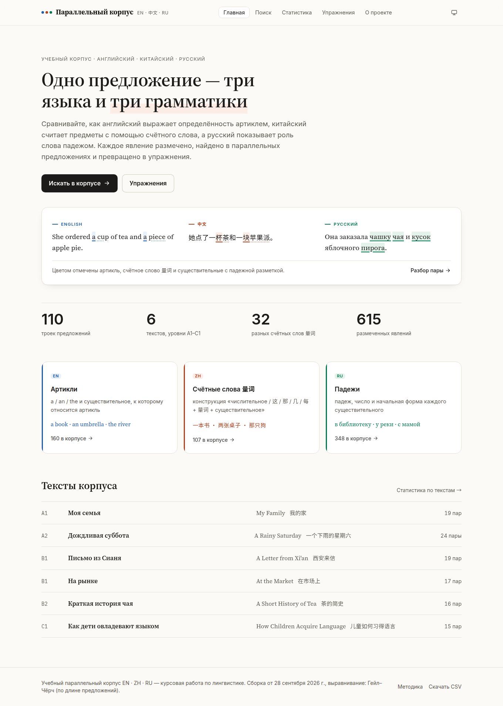

## Возможности

- **Поиск** на любом из трёх языков с подсветкой во всех колонках. Русские существительные
  находятся по лемме («чай» → «чая», «чаем»). Вероятные переводы найденного слова подсвечиваются
  в других колонках — это словарь эквивалентов, построенный по корпусу. Фильтры: явление,
  конкретный падеж или 量词, текст, уровень, статус проверки, `alignment_score`.
- **Конкорданс (KWIC)**: найденное слово в центре, сортировка по левому и правому контексту и по
  ключевому слову.
- **Карточка пары**: три предложения с цветной разметкой, данные выравнивания, комментарий LLM,
  таблицы разметки и эквивалентов.
- **Статистика** (Recharts): падежи, частотность 量词, артикли, распределение `alignment_score`,
  сравнение текстов. Под каждым графиком есть таблица данных.
- **Упражнения**, собранные из предложений корпуса:
  - EN — вставить артикль;
  - ZH — выбрать 量词 из четырёх вариантов;
  - RU — поставить слово в нужный падеж.
  
  Проверка мгновенная, к каждому ответу — объяснение, в конце — итоги. Прогресс сохраняется в
  браузере. Для уроков есть версия для печати с отдельной страницей ключей.
- **Проверка (золотой стандарт)**: эксперт размечает выборку пар — выравнивание EN–ZH и EN–RU
  и каждую пометку (верно / ошибка / исправление, пропуски). Горячие клавиши, счётчик
  прогресса, экспорт и импорт `gold.json`. По этому файлу `python -m pipeline evaluate`
  считает точность, полноту и F1 (см. раздел «Оценка качества»).
- Светлая и тёмная тема, адаптивная вёрстка, навигация с клавиатуры. Проверка axe-core —
  0 нарушений WCAG 2.1 A/AA.

## Скриншоты

| Поиск: совпадения и эквиваленты | Конкорданс (KWIC) |
|---|---|
| 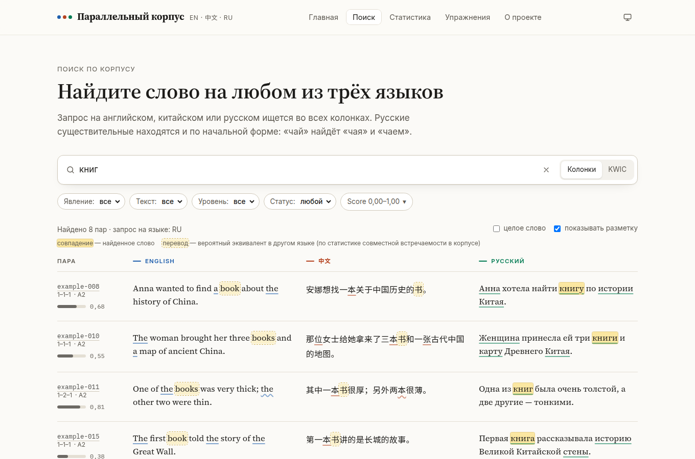 | 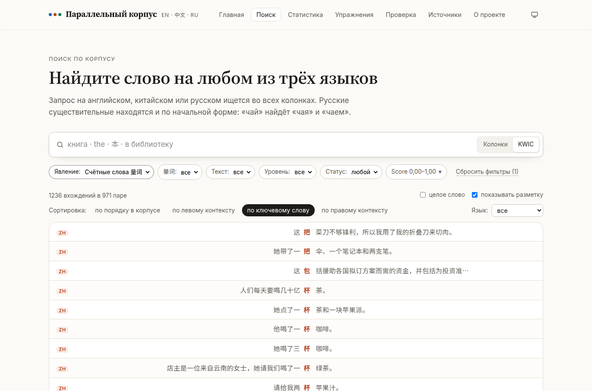 |
| **Карточка пары** | **Статистика** |
| 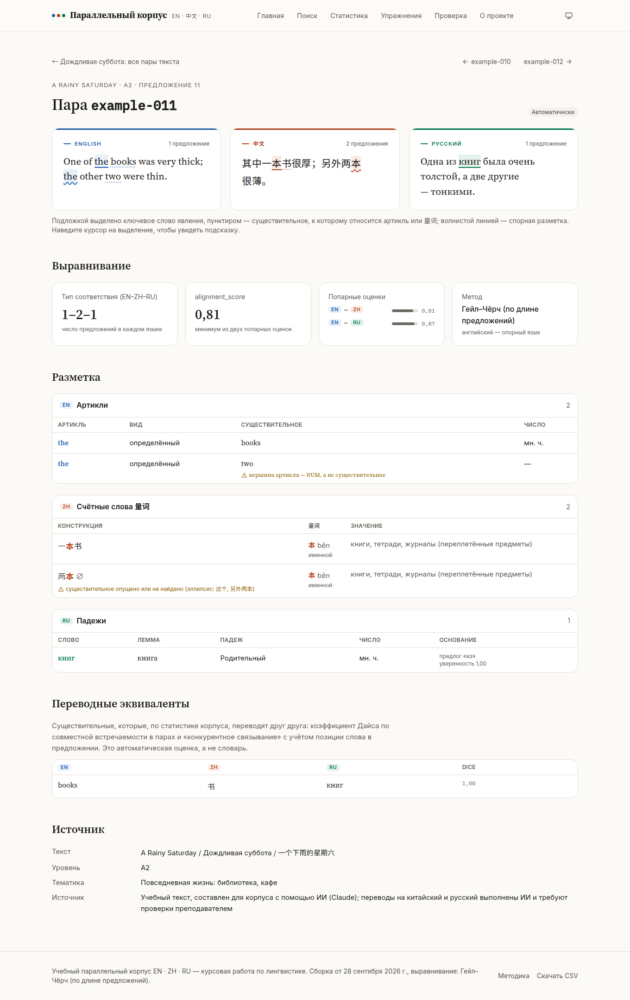 | 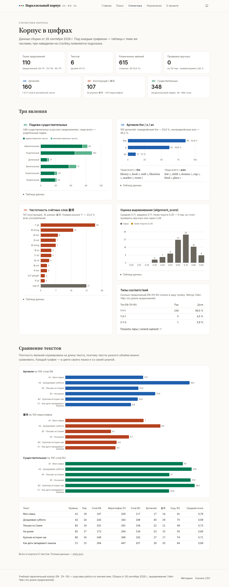 |
| **Упражнение на 量词** | **Версия для печати** |
| 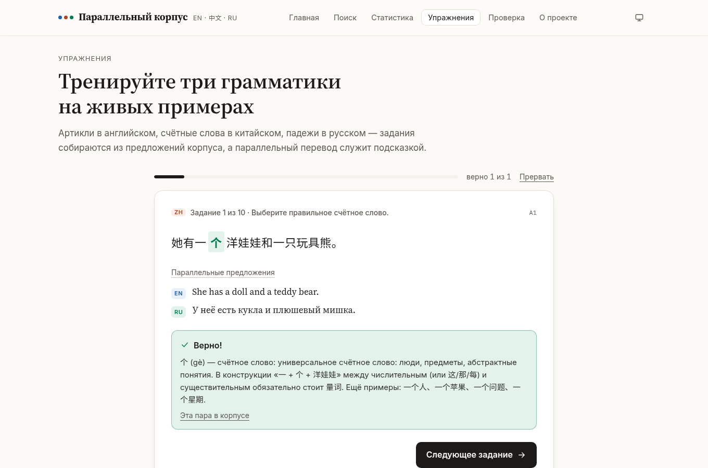 | 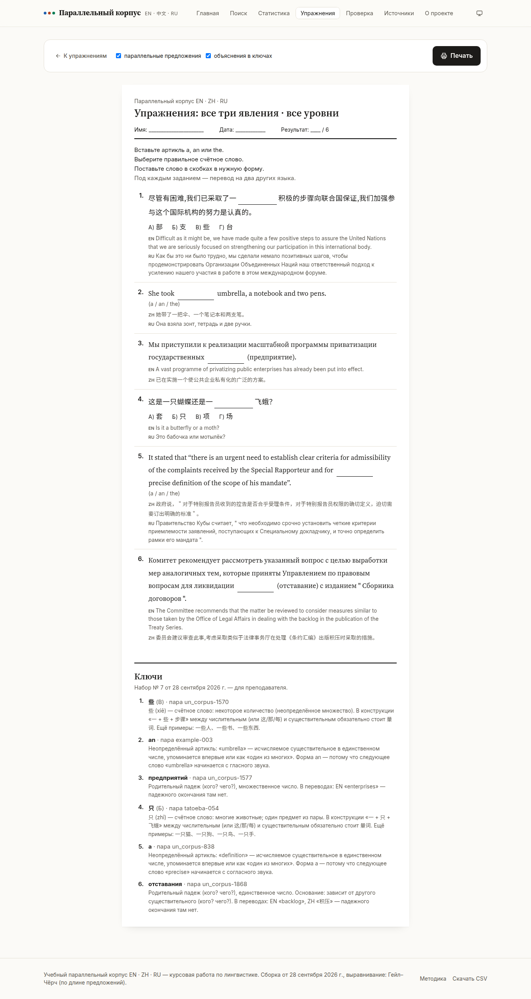 |
| **Тёмная тема** | **Телефон** |
| 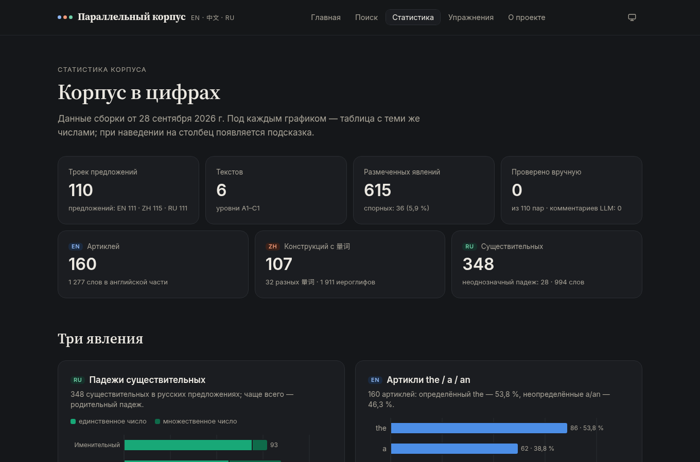 | 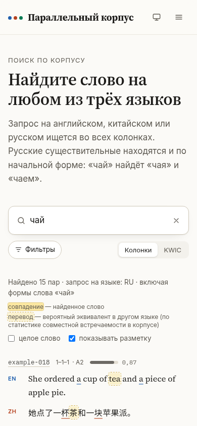 |

Макеты, из которых выбрано оформление, — в [`design/mockups.html`](design/mockups.html)
(открыть в браузере).

## Структура репозитория

```
pipeline/                     Python 3.11: тексты → корпус
  sources.py, segment.py      чтение текстов и сегментация
  align/                      выравнивание: LaBSE (алгоритм Bertalign), bertalign, Гейл–Чёрч
  annotate/                   разметка: en.py (артикли), zh.py (量词), ru.py (падежи)
  lexicon.py                  переводные эквиваленты (коэффициент Дайса)
  manual.py, llm.py           ручные правки из CSV, LLM-проверка
  export.py, report.py        corpus.json / corpus.csv / stats.json, журнал сборки
  gold.py, evaluate.py        золотой стандарт и оценка качества (P / R / F1)
  metrics.py, charts.py, tables.py  метрики, графики PNG и таблицы CSV для отчётов
  resources/zh_classifiers.tsv  редактируемый список счётных слов
  config.yaml                 все настройки
  tests/                      pytest (tests/fixtures — синтетические данные для тестов)
data/raw/<text_id>/           входные тексты: en.txt, zh.txt, ru.txt, meta.json
data/manual/overrides.json    ручные правки (создаётся импортом CSV)
data/llm_cache/               сохранённые ответы LLM
data/gold/gold.json           эталон — экспорт из режима «Проверка» (создаёт эксперт)
reports/                      отчёты для курсовой: evaluation.md, CSV, PNG
logs/build_report.md          журнал последней сборки
web/                          сайт: Vite + React + TypeScript + Tailwind
  public/data/                данные для сайта (результат pipeline)
  src/lib/                    поиск, KWIC, упражнения, прогресс, эталон (с тестами Vitest)
  src/pages/                  главная, поиск, пара, статистика, упражнения, печать, проверка,
                              о проекте
  scripts/screenshots.mjs     скриншоты и проверка доступности (axe-core)
design/mockups.html           макеты главной и поиска
docs/screenshots/             скриншоты для README
scripts/setup.ps1             установка на Windows одной командой
.github/workflows/            CI (pytest, ruff, ESLint, Prettier, TypeScript, Vitest) и деплой
```

## Установка на Windows

Понадобятся:
- [Python 3.11](https://www.python.org/downloads/release/python-3119/) — при установке отметьте
  **«Add python.exe to PATH»**;
- [Node.js 22 LTS](https://nodejs.org/);
- [Git](https://git-scm.com/download/win).

```powershell
git clone https://github.com/lolkotick/corpus.git
cd corpus
.\scripts\setup.ps1          # или .\scripts\setup.ps1 -Neural — вместе с LaBSE (~2 ГБ)
```

Если PowerShell пишет, что выполнение сценариев отключено, выполните один раз:
`Set-ExecutionPolicy -Scope CurrentUser RemoteSigned`.

<details>
<summary>То же вручную (и для Linux/macOS)</summary>

```powershell
py -3.11 -m venv .venv
.venv\Scripts\Activate.ps1                 # Linux/macOS: source .venv/bin/activate
python -m pip install -r pipeline\requirements-dev.txt
python -m spacy download en_core_web_sm
cd web
npm ci
```
</details>

## Запуск pipeline

Все команды выполняются из корня репозитория с активированным окружением
(`.venv\Scripts\Activate.ps1`):

```powershell
python -m pipeline check            # проверить входные тексты (абзацы, число предложений)
python -m pipeline build            # собрать корпус
python -m pipeline build --no-llm   # собрать без запросов к LLM
pytest                              # тесты pipeline
```

Результат сборки:
- `web/public/data/corpus.json` — корпус для сайта;
- `web/public/data/corpus.csv` — таблица для проверки в Excel;
- `web/public/data/stats.json` — статистика;
- `logs/build_report.md` — журнал сборки: время каждого этапа, число пар по текстам, типы
  соответствий, результаты разметки, предупреждения, число правок, предложенных LLM.

Этапы: чтение → сегментация → выравнивание → ручные правки → разметка EN / ZH / RU →
переводные эквиваленты → LLM-проверка → экспорт.

### Выравнивание: LaBSE или Гейл–Чёрч

В `pipeline/config.yaml` параметр `alignment.method: auto` пробует методы по очереди:
1. пакет `bertalign` (только Python ≥ 3.12);
2. LaBSE через `sentence-transformers` — тот же алгоритм Bertalign, реализованный в
   `align/embedding.py`;
3. метод Гейла–Чёрча по длине предложений.

Для нейросетевого варианта: `pip install -r pipeline\requirements-neural.txt` — при первом
запуске скачается модель LaBSE (~1,8 ГБ). Какой метод сработал и почему, записывается в журнал
сборки.

Английский — опорный язык. Пары EN–ZH и EN–RU выравниваются отдельно (1–1, 1–2, 2–1) и
объединяются в тройки. `alignment_type` — число предложений EN-ZH-RU (например, `1-2-1`),
`alignment_score` — оценка 0…1 по более слабой паре. Если число абзацев во всех трёх файлах
совпадает, выравнивание идёт внутри абзацев.

### LLM-проверка (необязательно)

Скопируйте `.env.example` в `.env` и впишите `ANTHROPIC_API_KEY=...`. Модуль отправляет модели
пары с низким `alignment_score` и спорную разметку и записывает в `llm_note` вердикт, предложение
исправления и комментарий.
- **Данные модель не меняет.**
- Модель, глубина рассуждений и лимит пар задаются в секции `llm` файла `config.yaml`.
- Ответы сохраняются в `data/llm_cache/`, поэтому повторная сборка не тратит запросы, а сборка
  без ключа применяет уже полученные ответы.
- Без ключа модуль просто пропускается.

## Добавление текста

1. Создайте папку `data/raw/<id_текста>/` — латиницей, без пробелов, например `data/raw/winter_story/`.
2. Положите туда `en.txt`, `zh.txt`, `ru.txt` в кодировке UTF-8. Абзацы разделяйте пустой
   строкой: если число абзацев во всех файлах совпадает, выравнивание будет точнее.
3. Создайте `meta.json`:

   ```json
   {
     "title": "A Rainy Saturday",
     "title_ru": "Дождливая суббота",
     "title_zh": "一个下雨的星期六",
     "source": "Откуда взят текст",
     "topic": "Тематика",
     "level": "A2"
   }
   ```

   Уровень — от A1 до C2. Обязательны `title`, `source`, `topic` и `level`.
4. Выполните `python -m pipeline check`, затем `python -m pipeline build`.

Счётные слова для китайской разметки перечислены в `pipeline/resources/zh_classifiers.tsv`.
Файл можно редактировать в Excel или блокноте: колонки через табуляцию — классификатор,
пиньинь, тип, толкование, типичные существительные.

## Ручная проверка через CSV

1. Откройте `web/public/data/corpus.csv` в Excel: **Данные → Из текста/CSV**, кодировка UTF-8.
2. Исправьте текст в колонках `en` / `zh` / `ru`, поставьте статус и при необходимости добавьте
   комментарий в колонку `comment`. Статусы:
   - `checked` («проверено») — пара проверена, ошибок нет;
   - `corrected` («исправлено») — текст или выравнивание исправлены (ставится автоматически,
     если текст изменён);
   - `delete` («удалить») — убрать пару из корпуса.

   Колонки `annotations` и `llm_note` — справочные, их не нужно править.
3. Сохраните файл как **«CSV UTF-8 (разделитель — запятая)»** — иначе иероглифы потеряются.
   Разделитель `;` тоже подходит: он определяется автоматически.
4. Импортируйте правки:

   ```powershell
   python -m pipeline import-csv путь\к\corpus.csv            # сохранить правки и пересобрать
   python -m pipeline import-csv путь\к\corpus.csv --dry-run  # только показать изменения
   ```

Правки сохраняются в `data/manual/overrides.json` и применяются при каждой сборке.
Исправленный текст размечается заново. Если после изменения входных текстов автоматический
сегмент с тем же id стал другим, правка не применяется, а в журнале сборки появляется
предупреждение.

## Сайт локально

```powershell
cd web
npm run dev        # режим разработки: http://localhost:5173
npm run build      # сборка в web/dist
npm run preview    # просмотр собранного сайта: http://localhost:4173
```

Проверки качества — те же, что в CI:

```powershell
npm run lint           # ESLint (строгие правила typescript-eslint, jsx-a11y, запрет any)
npm run format:check   # Prettier
npm run typecheck      # TypeScript
npm test               # Vitest: поиск, KWIC, упражнения
```

Скриншоты и проверка доступности (нужен запущенный `npm run preview` и
`npx playwright install chromium`): `npm run screenshots -- --axe`.

## Деплой на GitHub Pages

Сайт публикуется workflow `.github/workflows/deploy.yml` при каждом пуше в `main`.

1. Один раз включите Pages: **Settings → Pages → Build and deployment → Source: GitHub Actions**.
2. Обновите данные (`python -m pipeline build`), закоммитьте `web/public/data/` и отправьте в
   `main`. Workflow соберёт сайт и опубликует его по адресу
   `https://<пользователь>.github.io/<репозиторий>/` — здесь <https://lolkotick.github.io/corpus/>.

Сайт использует `HashRouter` и относительные пути (`base: './'`), поэтому работает в любой
подпапке и не требует серверных перенаправлений. Workflow CI (`ci.yml`) на каждом PR запускает
pytest, ruff, ESLint, Prettier, TypeScript, Vitest и сборку.

## Оценка качества по золотому стандарту

1. На сайте откройте «Проверка», задайте объём выборки (например, 30 пар) и seed.
   Пары отбираются случайно, пропорционально размеру текстов; один seed — одна выборка.
2. Для каждой пары оцените выравнивание и пометки. Основные клавиши: `1` — верно
   (для явления — «всё верно»), `2` — ошибка, `3` — исправить, `↑`/`↓` — строка, `←`/`→` — пара,
   `A` — остальное верно, `?` — справка. Результат сохраняется в браузере.
3. Нажмите «Экспорт gold.json» и сохраните файл как `data/gold/gold.json`
   (формат описан в [`data/gold/README.md`](data/gold/README.md)).
4. Запустите оценку:

   ```powershell
   python -m pipeline evaluate
   ```

   Результат — `reports/evaluation.md` (сводная таблица с 95% доверительными интервалами,
   матрица ошибок по падежам), CSV-таблицы и графики PNG (300 dpi) в `reports/`.

Эталон составляет только эксперт: pipeline его не создаёт и не дополняет. Пока `gold.json`
нет, отчёт сообщает, что данных нет, и не показывает никаких чисел.

| Выбор выборки | Проверка пары |
|---|---|
| 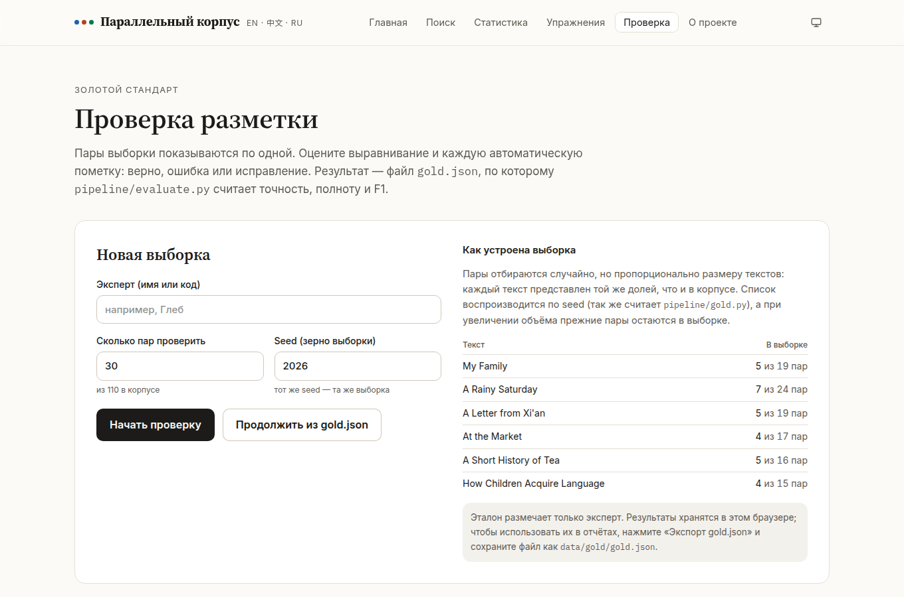 | 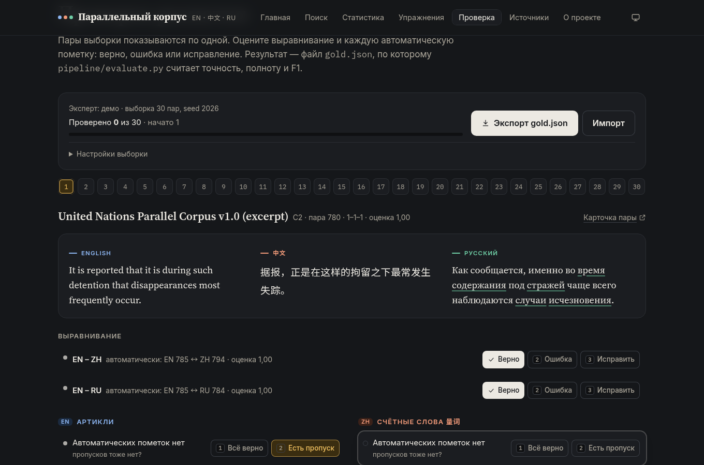 |

## Формат данных

Одна запись `corpus.json` (тройка предложений):

```json
{
  "id": "example-018",
  "text_id": "example",
  "en": "She ordered a cup of tea and a piece of apple pie.",
  "zh": "她点了一杯茶和一块苹果派。",
  "ru": "Она заказала чашку чая и кусок яблочного пирога.",
  "alignment_type": "1-1-1",
  "alignment_score": 0.8655,
  "alignment": { "method": "gale_church", "en_zh": 0.8655, "en_ru": 0.9649, "low": false },
  "sentences": { "en": [17], "zh": [17], "ru": [17] },
  "annotations": {
    "en": [{ "id": "en1", "kind": "article", "start": 12, "end": 13, "text": "a", "value": "a",
             "definite": false, "head": { "start": 14, "end": 17, "text": "cup", "number": "sing" } }],
    "zh": [{ "id": "zh1", "kind": "classifier", "start": 4, "end": 5, "text": "杯", "pinyin": "bēi",
             "det": { "text": "一" }, "head": { "text": "茶" } }],
    "ru": [{ "id": "ru1", "kind": "case", "start": 13, "end": 18, "text": "чашку", "lemma": "чашка",
             "case": "accs", "number": "sing", "confidence": 1.0, "ambiguous": false }]
  },
  "links": [{ "en": [21, 24], "zh": [5, 6], "ru": [19, 22], "score": 0.828 }],
  "status": "auto",
  "llm_note": null,
  "comment": ""
}
```

`sentences` — номера предложений текста (с нуля), из которых состоит пара; сами предложения
лежат в `texts[].sentences`. По ним сравнивается выравнивание с эталоном.

Позиции `start` / `end` — номера символов (кодовых точек Unicode) внутри поля `en` / `zh` / `ru`:
сам текст разметка не меняет. Пример сокращён; полный набор полей описан в
`web/src/data/types.ts`.

## Тесты

- **Pipeline:** 103 теста pytest. Покрыты сегментация, выравнивание (включая LaBSE на
  поддельных эмбеддингах и обёртку bertalign), разметка каждого языка, словарь эквивалентов,
  импорт CSV, LLM-модуль с поддельным API, полная сборка, цикл CSV → правки → пересборка,
  чтение эталона и метрики `evaluate.py` (на синтетических данных из
  `pipeline/tests/fixtures/`, помеченных `synthetic: true`).
- **Сайт:** 49 тестов Vitest — поиск, подсветка, KWIC, генератор упражнений на реальном
  корпусе, выборка и модель проверки (выборка совпадает с Python-реализацией).
- **Доступность:** axe-core на всех страницах в обеих темах — 0 нарушений WCAG 2.1 A/AA.

## Ограничения

- Тексты корпуса (6 текстов, 110 троек) составлены и переведены с помощью ИИ для демонстрации
  метода; перед использованием на занятиях их должен проверить преподаватель.
- В среде, где собирался этот корпус, модель LaBSE скачать не удалось (доступ к Hugging Face
  закрыт), поэтому выравнивание сделано запасным методом Гейла–Чёрча. На собственном компьютере
  pipeline переключится на LaBSE после установки `requirements-neural.txt`.
- Разметка автоматическая. pymorphy3 не видит синтаксиса, поэтому часть падежей определена
  эвристиками, а неуверенные случаи помечены как спорные. jieba ошибается в границах слов,
  поэтому существительное после 量词 ищется по правилам.
- Словарь эквивалентов статистический: на маленьком корпусе связаны только слова, встретившиеся
  хотя бы дважды, и возможны ошибки.
- В упражнениях по падежам засчитывается только форма из корпуса. Объяснения строятся по
  правилам и не заменяют преподавателя.
- Прогресс упражнений хранится только в этом браузере (localStorage).
- Шрифты подключаются с Google Fonts; без интернета сайт использует системные шрифты.
